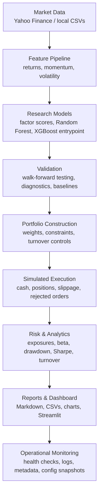
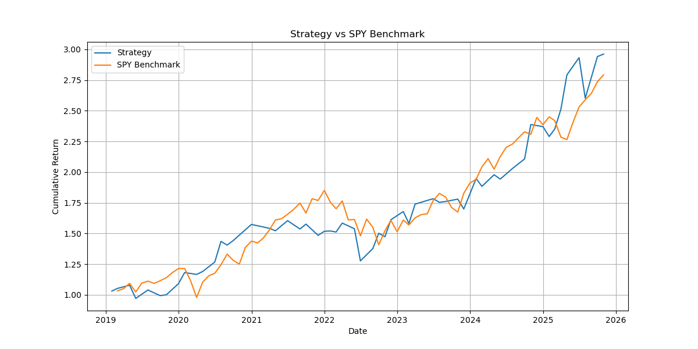
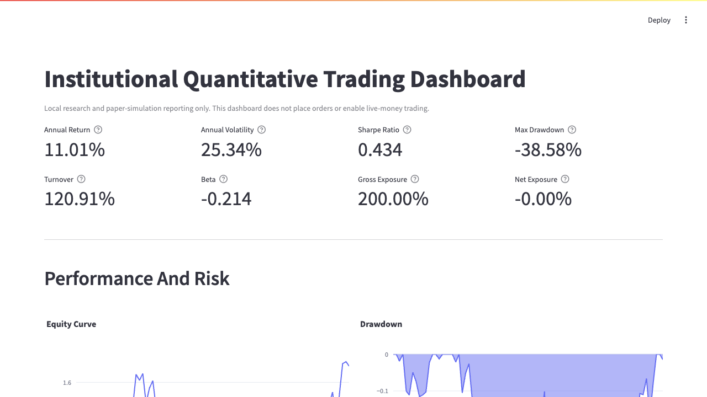

# Quantitative Trading Research and Paper-Trading Platform

This repository is a modular quantitative equity research and paper-trading platform built around
cross-sectional factor research, machine learning validation, portfolio construction, risk controls,
execution simulation, and reporting.

The project is designed to demonstrate a reproducible research workflow and a local simulated
paper-trading process. It is not a live-money trading system, and it does not enable real-money order
execution.

## At a Glance

- What it is: a Python research and simulated paper-trading platform for cross-sectional equity
  strategies.
- Why it matters: it shows how a signal moves through data preparation, validation, portfolio
  construction, risk checks, simulated execution, reporting, and monitoring.
- Skills demonstrated: factor research, return-label hygiene, machine learning ranking,
  walk-forward validation, transaction-cost-aware backtesting, portfolio constraints, execution
  simulation, dashboards, documentation, and tests.
- Fastest local check: run `python scripts/run_smoke_tests.py` or `make smoke`.
- Full workflow entry points: see `How to Run the Full Workflow` and `Command Shortcuts` below.
- Safety boundary: all trading workflows are local or simulated by default; results are research
  outputs, not investment promises.

## Project Highlights

- End-to-end quant workflow covering data ingestion, factor engineering, ML ranking, walk-forward
  validation, portfolio construction, execution simulation, and reporting.
- Cross-sectional equity strategy using momentum, short-term return, volatility, and
  machine-learning features across an S&P 100-style universe.
- Transaction-cost-aware backtesting with benchmark comparison, drawdown analytics, turnover
  tracking, and volatility-aware risk controls.
- Long-only simulated paper-trading system with cash accounting, positions, fills, rejected orders,
  stale-signal checks, and execution logs.
- Portfolio constraint layer covering max weights, exposure diagnostics, concentration, turnover,
  liquidity checks, and no-shorting behavior.
- Streamlit dashboard, Markdown reports, CSV outputs, operational logs, configuration snapshots, and
  automated tests for reviewability.
- Built as a local research and simulated paper-trading platform; no live-money execution is enabled.

## Recruiter Summary

This project presents a quantitative research and engineering workflow in Python, with emphasis
on defensible validation, transparent assumptions, reproducible outputs, and operational controls.
It demonstrates practical skills relevant to quant research, systematic trading, and financial
engineering interviews: feature design, return-label hygiene, walk-forward testing, transaction-cost
modeling, risk management, execution simulation, monitoring, reporting, and test coverage.

The repository is intentionally structured like a lightweight research platform rather
than a single notebook. Code is modular, outputs are documented, and limitations are stated directly
so reviewers can evaluate both the technical implementation and the research discipline behind it.

## Quick Links

- Research report: `reports/quant_research_report.md`
- Paper-trading status: `reports/paper_trading_status.md`
- System health report: `reports/system_status.md`
- Multi-day simulation report: `reports/multi_day_simulation_report.md`
- Dashboard: `dashboard/app.py`
- Daily paper-trading runner: `scripts/run_daily_paper_trading.py`
- Paper-trading checklist: `docs/paper_trading_checklist.md`
- Paper-trading journal template: `docs/paper_trading_journal_template.md`
- Paper-trading risk review: `docs/paper_trading_risk_review.md`
- Operational workflow: `docs/operational_workflow.md`
- Quant interview guide: `docs/quant_interview_guide.md`
- Central configuration: `config/platform_config.json`

Generated CSVs, charts, model files, execution logs, and operational JSONL logs are written under
`results/` or generated report folders. Selected report snapshots and charts are committed for
review; regenerated artifacts and local operator outputs are ignored where practical so the
repository stays focused on reproducible code, configuration, documentation, and lightweight evidence.

## System Architecture

The platform is organized as a research-to-operations pipeline: market data flows into feature
generation, model validation, portfolio construction, simulated execution, risk analytics, reporting,
and operational monitoring.

### Architecture Overview



### Visual Output Map

| Research Layer | Review Artifact |
|---|---|
| Strategy backtesting | `results/strategy_vs_benchmark.png`, `results/multi_factor_results.csv` |
| Risk analytics | `results/reports/drawdown.png`, `results/reports/rolling_sharpe.png` |
| Live signals | `results/live/latest_signals.csv` |
| Paper trading | `results/simulation/execution_log.csv`, `reports/paper_trading_status.md` |
| Monitoring | `results/operations/latest_system_status.json`, `reports/system_status.md` |

## Repository Structure

```text
algorithmic-trading-project/
├── config/                       # Central platform configuration
├── dashboard/                    # Streamlit reporting dashboard
├── docs/                         # Operator checklists and workflow notes
├── reports/                      # Lightweight Markdown report snapshots
├── scripts/                      # Daily paper-trading workflow runner
├── src/
│   ├── backtests/                # Strategy and benchmark backtest engines
│   ├── data/                     # Reusable data loading helpers
│   ├── execution/                # Simulated broker and paper execution tools
│   ├── features/                 # Factor and ML feature generation
│   ├── live/                     # Local signal generation for paper trading
│   ├── models/                   # ML training and validation utilities
│   ├── operations/               # Config loading, structured logging, health checks
│   ├── portfolio/                # Allocation, constraints, and portfolio utilities
│   ├── reporting/                # Metrics, analytics, charts, and summary reports
│   ├── risk/                     # Exposure and volatility utilities
│   └── simulation/               # Multi-day paper-trading simulation
├── tests/                        # Automated correctness and safety tests
├── requirements.txt
└── README.md
```

## How to Run the Full Workflow

Install dependencies:

```bash
pip install -r requirements.txt
```

Run the data pipeline:

```bash
python src/data_loader.py
python src/factors.py
python src/ml_dataset.py
```

Run research backtests and model validation:

```bash
python src/train_ml_model.py
python src/train_xgboost_model.py
python src/multi_factor_backtest.py
python src/walk_forward_ml_backtest.py
python src/risk_managed_backtest.py
python src/generate_report.py
```

Run live signal generation for the simulated paper-trading workflow:

```bash
python src/live/generate_live_signals.py
```

Run simulated paper trading:

```bash
python scripts/run_daily_paper_trading.py
python src/simulation/run_multi_day_simulation.py
```

Run the dashboard:

```bash
streamlit run dashboard/app.py
```

Run tests:

```bash
pytest -q
```

Run the end-to-end smoke test runner:

```bash
python scripts/run_smoke_tests.py
```

Run a syntax smoke test across the source tree:

```bash
python -m compileall src scripts dashboard tests
```

## Command Shortcuts

The repository includes a `Makefile` with simple reproducibility shortcuts. These commands wrap
existing scripts only and are safe by default: they support local research, reporting, simulated
paper trading, and dashboard review. They do not enable live-money trading.

| Command | Purpose |
|---|---|
| `make install` | Install Python dependencies from `requirements.txt`. |
| `make test` | Run the automated test suite with `pytest -q`. |
| `make smoke` | Run the lightweight end-to-end smoke test runner. |
| `make signals` | Generate the latest local paper-trading signal file. |
| `make paper` | Run the local simulated paper-trading workflow with data refresh skipped. |
| `make dashboard` | Start the Streamlit dashboard. |
| `make report` | Regenerate research and risk summary reports. |
| `make health` | Run the operational health check. |

## Paper Trading Workflow

The paper-trading workflow is local and simulated by default. It refreshes data, rebuilds features,
generates signals, applies safety checks, routes orders through the simulated broker, updates risk
reports, and refreshes dashboard inputs.

Run the daily workflow:

```bash
python scripts/run_daily_paper_trading.py
```

Run the same workflow without downloading fresh data:

```bash
python scripts/run_daily_paper_trading.py --skip-data-refresh
```

Run a multi-day operating-loop simulation:

```bash
python src/simulation/run_multi_day_simulation.py
```

Useful simulation options:

```bash
python src/simulation/run_multi_day_simulation.py --rebalance-frequency daily
python src/simulation/run_multi_day_simulation.py --start 2025-08-01 --end 2025-12-31
```

The simulated broker tracks:

- Cash and portfolio value.
- Long-only positions.
- Trade history and rejected orders.
- Slippage-adjusted fill prices.
- Transaction costs.
- Portfolio snapshots and execution logs.
- Stale signal and missing price diagnostics.

The workflow never submits live-money orders. The separate Alpaca paper executor is dry-run by
default and targets paper endpoints only.

## Strategy And Validation

The research stack combines transparent factor models with machine-learning ranking:

- 12-month momentum: `Price(t) / Price(t - 252) - 1`.
- Short-term momentum: `Price(t) / Price(t - 21) - 1`.
- 21-day rolling volatility.
- Random Forest return-ranking model using 1-month forward returns as labels.
- XGBoost training entrypoint for comparison experiments.
- Expanding-window walk-forward validation.

The reported walk-forward schedule is:

| Train Period | Test Period |
|---|---|
| 2018-2021 | 2022 |
| 2018-2022 | 2023 |
| 2018-2023 | 2024 |
| 2018-2024 | 2025 |

Forward returns are used only as labels or realized outcomes. They are not used to form live
signals.

## Quant Research Concepts Demonstrated

- Factor research: momentum, short-term return, volatility, and ML-derived ranking features.
- IC testing: rank information coefficient analysis for factor quality review.
- Walk-forward validation: expanding-window training and out-of-sample test periods.
- Transaction-cost-aware backtesting: turnover and cost assumptions included in strategy evaluation.
- Volatility targeting: volatility-adjusted sizing utilities and risk-managed backtest outputs.
- Portfolio constraints: long-only weights, max position sizing, exposure diagnostics,
  concentration checks, and liquidity-aware controls where data is available.
- Execution simulation: simulated broker with cash, positions, fills, slippage, transaction costs,
  rejected orders, and paper-trading logs.
- Operational monitoring: structured logs, run metadata, config snapshots, health reports, and stale
  signal checks.

## Risk Controls

The platform includes reusable controls and diagnostics intended to make portfolio behavior more
auditable:

- Max position sizing.
- Sector exposure tracking and limits.
- Gross and net exposure tracking.
- Concentration metrics and top-holdings reports.
- Turnover-aware transaction cost calculations.
- Volatility-adjusted sizing utilities.
- Liquidity and average daily dollar volume filters when volume data is available.
- Rolling volatility, rolling Sharpe, rolling drawdown, and rolling beta analytics.
- Long-only paper-trading mode by default.
- No-shorting and no-leverage checks in the simulated broker.
- Missing price, stale signal, duplicate ticker, and abnormal target-weight checks.
- Structured operational logs, run metadata, config snapshots, and health monitoring.

These controls are designed to make unrealistic assumptions visible. They are not presented as a
complete production risk system.

## Results Summary

The committed research report, `reports/quant_research_report.md`, records the following historical
research snapshot:

| Metric | Research Report Snapshot |
|---|---:|
| Multi-factor annual return | 24.92% |
| Multi-factor annual volatility | 21.43% |
| Multi-factor Sharpe ratio | 1.16 |
| Multi-factor max drawdown | -20.43% |
| Multi-factor cumulative return | 196.10% |
| Multi-factor turnover | 137.41% |
| Latest turnover | 110.00% |
| Beta vs SPY | -0.42 |
| Walk-forward ML annual return | 23.1% |
| Walk-forward ML Sharpe ratio | 0.88 |

These numbers are historical research outputs, not forward-looking claims. They should be interpreted
with the limitations below, especially survivorship bias, simplified transaction costs, and idealized
execution assumptions.

### Result Integrity Note

The generated outputs currently in `results/reports/summary_report.md` and
`results/reports/summary_report.csv` reflect a later regenerated summary and do not match every
headline metric in the research-report snapshot above. The generated summary currently records:

| Metric | Latest Generated Summary |
|---|---:|
| Annual return | 11.01% |
| Annual volatility | 25.34% |
| Sharpe ratio | 0.43 |
| Max drawdown | -38.58% |
| Average one-way turnover | 120.91% |
| Latest turnover | 170.00% |
| Beta | -0.21 |
| Cumulative return | 69.62% |

The current `results/multi_factor_equity_curve.csv` also ends at a cumulative value of approximately
`1.6962`, consistent with a cumulative return near `69.62%`. Treat the headline table as a
documented research snapshot and the generated summary files as the latest local output artifacts.

The latest paper-trading status report records:

| Paper-Trading Field | Existing Report Value |
|---|---:|
| Portfolio value | 113855.54 |
| Cash | 1196.86 |
| Positions | 10 |
| Turnover | 0.0000 |
| Drawdown | -0.11% |
| Trades filled | 0 |
| Rejected orders | 0 |

The latest system health report records `WARNING` because recent execution history contains rejected
order events. This is retained intentionally as operational memory rather than hidden.

## Screenshots / Outputs

### Strategy vs Benchmark



### Drawdown


### Rolling Sharpe


### Dashboard



The dashboard can be opened locally with:

```bash
streamlit run dashboard/app.py
```

Key committed outputs for GitHub review:

- Strategy vs benchmark chart: [`results/strategy_vs_benchmark.png`](results/strategy_vs_benchmark.png)
- Walk-forward ML strategy chart: [`results/walk_forward_ml_strategy.png`](results/walk_forward_ml_strategy.png)
- Risk-managed equity curve: [`results/risk_managed_equity_curve.png`](results/risk_managed_equity_curve.png)
- Report equity curve: [`results/reports/equity_curve.png`](results/reports/equity_curve.png)
- Drawdown chart: [`results/reports/drawdown.png`](results/reports/drawdown.png)
- Rolling Sharpe chart: [`results/reports/rolling_sharpe.png`](results/reports/rolling_sharpe.png)
- Rolling volatility chart: [`results/reports/rolling_volatility.png`](results/reports/rolling_volatility.png)
- Monthly return heatmap: [`results/reports/monthly_return_heatmap.png`](results/reports/monthly_return_heatmap.png)
- Dashboard screenshot: [`docs/assets/dashboard_screenshot.png`](docs/assets/dashboard_screenshot.png)
- Multi-day simulation exposure trends:
  [`results/simulation/multi_day/exposure_trends.png`](results/simulation/multi_day/exposure_trends.png)
- Multi-day simulation turnover trends:
  [`results/simulation/multi_day/turnover_trends.png`](results/simulation/multi_day/turnover_trends.png)

Primary written reports:

- Quant research report: [`reports/quant_research_report.md`](reports/quant_research_report.md)
- Paper-trading status: [`reports/paper_trading_status.md`](reports/paper_trading_status.md)
- System status: [`reports/system_status.md`](reports/system_status.md)
- Multi-day simulation report:
  [`reports/multi_day_simulation_report.md`](reports/multi_day_simulation_report.md)
- Generated summary report: [`results/reports/summary_report.md`](results/reports/summary_report.md)

Selected data outputs:

- Latest live signals: [`results/live/latest_signals.csv`](results/live/latest_signals.csv)
- Multi-factor backtest results: [`results/multi_factor_results.csv`](results/multi_factor_results.csv)
- Momentum IC results: [`results/momentum_ic_results.csv`](results/momentum_ic_results.csv)
- Paper-trading execution log: [`results/simulation/execution_log.csv`](results/simulation/execution_log.csv)
- Latest account snapshot:
  [`results/simulation/latest_account_snapshot.csv`](results/simulation/latest_account_snapshot.csv)

## Reporting And Dashboard

The reporting layer produces:

- Equity curve and drawdown reports.
- Rolling Sharpe and rolling volatility.
- Rolling beta when benchmark data is available.
- Portfolio exposure reports.
- Sector exposure reports.
- Turnover reports.
- Risk constraint summaries.
- ML baseline comparison and prediction stability reports.
- Monthly return heatmap.
- Paper-trading and multi-day simulation status reports.

The dashboard reads from `results/`, `reports/`, execution logs, and live signal outputs. It is a
local reporting interface and does not place trades.

## Operational Controls

Workflow settings live in `config/platform_config.json`, including:

- Strategy parameters.
- Transaction costs and slippage assumptions.
- Rebalance frequency.
- Risk limits.
- Simulation settings.
- Monitoring thresholds.

Operational runs save:

- Structured JSONL events.
- Run metadata.
- Configuration snapshots.
- Deterministic random seed information.
- Latest system health status.

Run the health monitor directly:

```bash
python src/operations/health.py
```

## Known Limitations

- The equity universe is static and S&P 100-style, so the research is not free of survivorship bias.
- Historical constituents are not point-in-time.
- Yahoo Finance data is convenient for research but not institutional-grade market data.
- Transaction costs and slippage are simplified assumptions.
- Short borrow costs, financing costs, taxes, locates, and hard-to-borrow constraints are not fully
  modeled.
- Intraday execution, queue position, partial fills, venue selection, and market impact are not
  modeled.
- Liquidity filtering depends on volume data availability.
- Sector classifications are maintained locally and should be reviewed against a benchmark provider.
- Walk-forward validation is stronger than a static split, but it does not remove all model-selection
  or research-iteration bias.
- The platform is designed for local research and simulated paper trading, not production deployment
  or live-money execution.

## Testing

The test suite focuses on correctness and safety:

- Factor formula calculations.
- Portfolio weight construction.
- Max-position constraints.
- Long-only and no-shorting behavior.
- Simulated broker cash and position accounting.
- Stale and future signal rejection.
- Sharpe, drawdown, and turnover calculations.

Run:

```bash
pytest -q
```

Current local smoke test status from the latest development pass:

```text
17 passed
```

## Recruiting-Relevant Skills Demonstrated

- Quantitative research workflow design.
- Factor engineering and return-label hygiene.
- Walk-forward model validation.
- Portfolio construction and risk controls.
- Transaction-cost-aware backtesting.
- Paper-trading simulation and execution logging.
- Operational monitoring and reproducibility tooling.
- Modular Python architecture.
- Automated testing for financial software safety checks.
