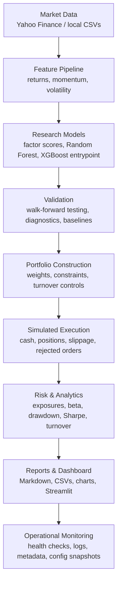

# Institutional-Style Quantitative Trading Research Platform

This repository is a modular quantitative equity research and paper-trading platform built around
cross-sectional factor research, machine learning validation, portfolio construction, risk controls,
execution simulation, and institutional-style reporting.

The project is designed for research defensibility and operational robustness, not for maximizing
backtest returns. It does not enable live-money trading.

## Executive Summary

The platform demonstrates an end-to-end quant workflow:

- Data ingestion and factor generation for an S&P 100-style equity universe.
- Momentum, short-term return, volatility, and machine-learning ranking features.
- Walk-forward model validation to reduce look-ahead bias.
- Transaction-cost-aware portfolio construction and benchmark comparison.
- Portfolio risk controls for exposure, concentration, turnover, liquidity, and volatility.
- Long-only simulated paper-trading infrastructure with cash, positions, fills, rejected orders,
  and execution logs.
- Streamlit dashboard and Markdown/CSV reporting for institutional review.
- Automated tests covering factor formulas, portfolio weights, broker accounting, no-shorting
  behavior, stale-signal checks, and risk metrics.

This is suitable as a quant research and engineering portfolio project because it emphasizes
validation quality, reproducibility, operational safety, and transparent assumptions.

## Quick Links

- Research report: `reports/quant_research_report.md`
- Paper-trading status: `reports/paper_trading_status.md`
- System health report: `reports/system_status.md`
- Multi-day simulation report: `reports/multi_day_simulation_report.md`
- Dashboard: `dashboard/app.py`
- Daily paper-trading runner: `scripts/run_daily_paper_trading.py`
- Paper-trading checklist: `docs/paper_trading_checklist.md`
- Operational workflow: `docs/operational_workflow.md`
- Central configuration: `config/platform_config.json`

Generated CSVs, charts, model files, execution logs, and operational JSONL logs are written under
`results/` or generated report folders. These artifacts are intentionally ignored by Git so the
repository stays focused on reproducible code, configuration, documentation, and lightweight report
snapshots.

## Architecture



## Repository Structure

```text
algorithmic-trading-project/
├── config/                       # Central platform configuration
├── dashboard/                    # Streamlit reporting dashboard
├── docs/                         # Operator checklists and workflow notes
├── reports/                      # Lightweight Markdown report snapshots
├── scripts/                      # Daily paper-trading workflow runner
├── src/
│   ├── backtests/                # Strategy and benchmark backtest engines
│   ├── data/                     # Reusable data loading helpers
│   ├── execution/                # Simulated broker and paper execution tools
│   ├── features/                 # Factor and ML feature generation
│   ├── live/                     # Local signal generation for paper trading
│   ├── models/                   # ML training and validation utilities
│   ├── operations/               # Config loading, structured logging, health checks
│   ├── portfolio/                # Allocation, constraints, and portfolio utilities
│   ├── reporting/                # Metrics, analytics, charts, and summary reports
│   ├── risk/                     # Exposure and volatility utilities
│   └── simulation/               # Multi-day paper-trading simulation
├── tests/                        # Automated correctness and safety tests
├── requirements.txt
└── README.md
```

## How To Run

Install dependencies:

```bash
pip install -r requirements.txt
```

Run the core research pipeline components:

```bash
python src/data_loader.py
python src/factors.py
python src/ml_dataset.py
python src/train_ml_model.py
python src/walk_forward_ml_backtest.py
python src/generate_report.py
```

Run the dashboard locally:

```bash
streamlit run dashboard/app.py
```

Run the automated test suite:

```bash
pytest -q
```

Run a syntax smoke test across the source tree:

```bash
python -m compileall src scripts dashboard tests
```

## Paper Trading Workflow

The paper-trading workflow is local and simulated by default. It refreshes data, rebuilds features,
generates signals, applies safety checks, routes orders through the simulated broker, updates risk
reports, and refreshes dashboard inputs.

Run the daily workflow:

```bash
python scripts/run_daily_paper_trading.py
```

Run the same workflow without downloading fresh data:

```bash
python scripts/run_daily_paper_trading.py --skip-data-refresh
```

Run a multi-day operating-loop simulation:

```bash
python src/simulation/run_multi_day_simulation.py
```

Useful simulation options:

```bash
python src/simulation/run_multi_day_simulation.py --rebalance-frequency daily
python src/simulation/run_multi_day_simulation.py --start 2025-08-01 --end 2025-12-31
```

The simulated broker tracks:

- Cash and portfolio value.
- Long-only positions.
- Trade history and rejected orders.
- Slippage-adjusted fill prices.
- Transaction costs.
- Portfolio snapshots and execution logs.
- Stale signal and missing price diagnostics.

The workflow never submits live-money orders. The separate Alpaca paper executor is dry-run by
default and targets paper endpoints only.

## Strategy And Validation

The research stack combines transparent factor models with machine-learning ranking:

- 12-month momentum: `Price(t) / Price(t - 252) - 1`.
- Short-term momentum: `Price(t) / Price(t - 21) - 1`.
- 21-day rolling volatility.
- Random Forest return-ranking model using 1-month forward returns as labels.
- XGBoost training entrypoint for comparison experiments.
- Expanding-window walk-forward validation.

The reported walk-forward schedule is:

| Train Period | Test Period |
|---|---|
| 2018-2021 | 2022 |
| 2018-2022 | 2023 |
| 2018-2023 | 2024 |
| 2018-2024 | 2025 |

Forward returns are used only as labels or realized outcomes. They are not used to form live
signals.

## Risk Controls

The platform includes reusable controls and diagnostics intended to make portfolio behavior more
auditable:

- Max position sizing.
- Sector exposure tracking and limits.
- Gross and net exposure tracking.
- Concentration metrics and top-holdings reports.
- Turnover-aware transaction cost calculations.
- Volatility-adjusted sizing utilities.
- Liquidity and average daily dollar volume filters when volume data is available.
- Rolling volatility, rolling Sharpe, rolling drawdown, and rolling beta analytics.
- Long-only paper-trading mode by default.
- No-shorting and no-leverage checks in the simulated broker.
- Missing price, stale signal, duplicate ticker, and abnormal target-weight checks.
- Structured operational logs, run metadata, config snapshots, and health monitoring.

These controls are designed to make unrealistic assumptions visible. They are not presented as a
complete production risk system.

## Results Summary

The latest committed research report, `reports/quant_research_report.md`, records the following
backtest outputs from the existing local result set:

| Metric | Existing Report Value |
|---|---:|
| Multi-factor annual return | 24.92% |
| Multi-factor annual volatility | 21.43% |
| Multi-factor Sharpe ratio | 1.16 |
| Multi-factor max drawdown | -20.43% |
| Multi-factor cumulative return | 196.10% |
| Multi-factor turnover | 137.41% |
| Latest turnover | 110.00% |
| Beta vs SPY | -0.42 |
| Walk-forward ML annual return | 23.1% |
| Walk-forward ML Sharpe ratio | 0.88 |

These numbers are historical research outputs, not forward-looking claims. They should be interpreted
with the limitations below, especially survivorship bias, simplified transaction costs, and idealized
execution assumptions.

The latest paper-trading status report records:

| Paper-Trading Field | Existing Report Value |
|---|---:|
| Portfolio value | 113855.54 |
| Cash | 1196.86 |
| Positions | 10 |
| Turnover | 0.0000 |
| Drawdown | -0.11% |
| Trades filled | 0 |
| Rejected orders | 0 |

The latest system health report records `WARNING` because recent execution history contains rejected
order events. This is retained intentionally as operational memory rather than hidden.

## Reporting And Dashboard

The reporting layer produces:

- Equity curve and drawdown reports.
- Rolling Sharpe and rolling volatility.
- Rolling beta when benchmark data is available.
- Portfolio exposure reports.
- Sector exposure reports.
- Turnover reports.
- Risk constraint summaries.
- ML baseline comparison and prediction stability reports.
- Monthly return heatmap.
- Paper-trading and multi-day simulation status reports.

The dashboard reads from `results/`, `reports/`, execution logs, and live signal outputs. It is a
local reporting interface and does not place trades.

## Operational Robustness

Deployment-facing settings live in `config/platform_config.json`, including:

- Strategy parameters.
- Transaction costs and slippage assumptions.
- Rebalance frequency.
- Risk limits.
- Simulation settings.
- Monitoring thresholds.

Operational runs save:

- Structured JSONL events.
- Run metadata.
- Configuration snapshots.
- Deterministic random seed information.
- Latest system health status.

Run the health monitor directly:

```bash
python src/operations/health.py
```

## Known Limitations

- The equity universe is static and S&P 100-style, so the research is not free of survivorship bias.
- Historical constituents are not point-in-time.
- Yahoo Finance data is convenient for research but not institutional-grade market data.
- Transaction costs and slippage are simplified assumptions.
- Short borrow costs, financing costs, taxes, locates, and hard-to-borrow constraints are not fully
  modeled.
- Intraday execution, queue position, partial fills, venue selection, and market impact are not
  modeled.
- Liquidity filtering depends on volume data availability.
- Sector classifications are maintained locally and should be reviewed against a benchmark provider.
- Walk-forward validation is stronger than a static split, but it does not remove all model-selection
  or research-iteration bias.
- The platform is designed for local research and simulated paper trading, not production deployment
  or live-money execution.

## Testing

The test suite focuses on correctness and safety:

- Factor formula calculations.
- Portfolio weight construction.
- Max-position constraints.
- Long-only and no-shorting behavior.
- Simulated broker cash and position accounting.
- Stale and future signal rejection.
- Sharpe, drawdown, and turnover calculations.

Run:

```bash
pytest -q
```

Current local smoke test status from the latest development pass:

```text
17 passed
```

## Recruiting-Relevant Skills Demonstrated

- Quantitative research workflow design.
- Factor engineering and return-label hygiene.
- Walk-forward model validation.
- Portfolio construction and risk controls.
- Transaction-cost-aware backtesting.
- Paper-trading simulation and execution logging.
- Operational monitoring and reproducibility tooling.
- Modular Python architecture.
- Automated testing for financial software safety checks.
